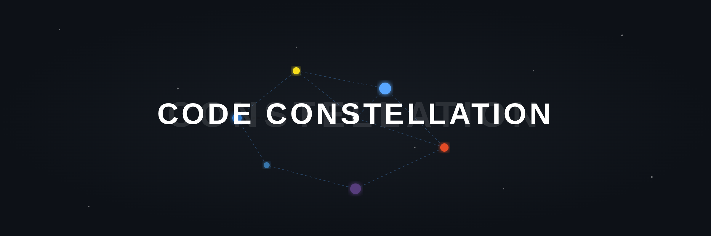

# Code Constellation 🌌

Visualizes your project's architecture as an interactive, force-directed graph. See your codebase like a galaxy of interconnected files.

## 🌠 The Concept

Every large codebase is a complex universe. **Code Constellation** turns your files into stars (nodes) and your imports into gravity (links). It helps you:

- **Understand Architecture:** Instantly see how modules are clustered and identify high-traffic hubs.
- **Trace Dependencies:** Follow the strings between files to see the ripple effects of your changes.
- **Navigate Faster:** Click any "star" to jump directly to that file in the editor.
- **Onboard Efficiently:** Give new developers a mental map of the system they are working on.

## ✨ Features

- **Interactive Physics:** Drag nodes around, zoom in/out, and watch the graph settle into its natural shape using a high-performance D3-based engine.
- **Intelligent Focus:** Hover over a node to highlight its direct "neighborhood" while dimming the rest of the universe.
- **Live Search:** Quickly find any file with the floating search bar at the top.
- **Sleek UI:** A modern, glassmorphism-inspired interface that integrates beautifully with VS Code's dark themes.
- **Smart Scanning:** Respects your `.gitignore` and common excludes (`node_modules`, `dist`, etc.) to keep the graph relevant.
- **Rich Previews:** Hover over nodes to see a styled popup with file metadata and the first 10 lines of code.

## 🚀 Getting Started

1.  **Install** the extension from the VS Code Marketplace.
2.  **Open** any project folder.
3.  **Launch** the graph via the Command Palette (`Ctrl+Shift+P` or `Cmd+Shift+P`):
    - Search for: `Code Constellation: Show Project Graph`
4.  **Explore!** Use your scroll wheel to zoom and drag nodes to reorganize your view.

## 🛠️ Supported Languages

Code Constellation currently parses imports/links for:
- **Web:** TypeScript (`.ts`, `.tsx`), JavaScript (`.js`, `.jsx`), CSS, SCSS, HTML.
- **Backend:** Python, Java, Go, Rust, PHP.
- **Data:** JSON, Markdown.

## 🤝 Contributing

We love contributions! Whether it's adding support for a new language parser, improving the UI, or fixing bugs. Check out our [CONTRIBUTING.md](./CONTRIBUTING.md) to get started.

## 📜 License

This project is licensed under the MIT License.

---
*Made with ❤️ for developers who love to see the big picture.*
